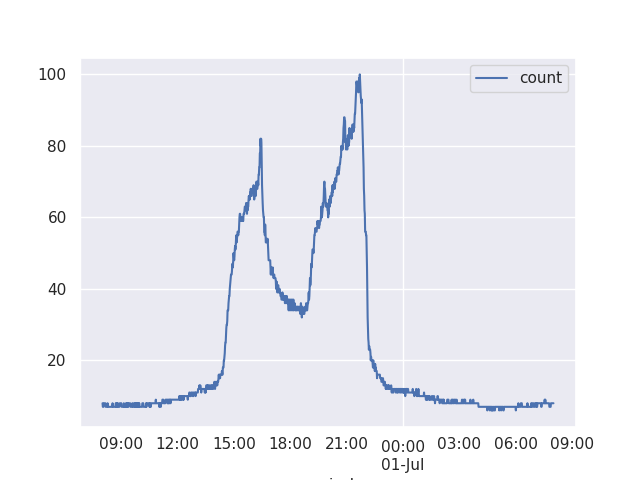

# Worldcup 98 Dataset

 Some details about the worldcup 98 dataset and way to get back the request rate at different time periods.

- More info about the dataset can be found in [WorldCup.html](WorldCup.html).

## Regenerating Results

There are only three steps to generate the invocation count results:

1. First, we need to download all the `.gz` files and place them inside `./input` folder.
2. Then, we need to parse the logs using the `ita_public_tools`. To do so, simply run the script:
```bash
# install requirements
pip install -r requirements.txt

# make the ita_public_tools
cd ita_public_tools
make
cd ..

# Run the script
python 01-load-convert.py
```
3. Finally, you can now just run the script that parses the results. Feel free to modify `02-generate-request-count.py` to match the fidelity that you need. Currently, it calculates aggregated number of requests per minute.

```bash
python 02-generate-request-count.py
```

## Usage

A sample usage can be seen from this simple python code:

```py
# Load the Dataset and grab a subset
# In this python code we grab the dataset and scale a subset of dataset to use as
# sample workload in our application.

import pandas as pd
import seaborn as sns
import matplotlib.pyplot as plt

csv_file = 'invocation_count.csv' # or use the url for the file in this repo to fetch remotely
df = pd.read_csv(csv_file, index_col=0, parse_dates=True)
df = df.groupby('period').sum()
# similar to paper: Stochastic Resource Provisioning for
#                   Containerized Multi-Tier Web Services in Clouds
sub_df = df['1998-06-30 08:00:01':'1998-07-01 08:00:00']

sns.set()

# Scaling the number of requests to another maximum
scaled_max = 100
scaled_sub_df = (sub_df / sub_df['count'].max() * scaled_max)
scaled_sub_df['count'] = scaled_sub_df['count'].apply(lambda x: float(x))

scaled_sub_df.plot()
plt.savefig('sample.png')
plt.show()

print(scaled_sub_df['count'].values)
```

## Sample Output

The section that is sliced by the code above, produces the following shape for user request patter:


